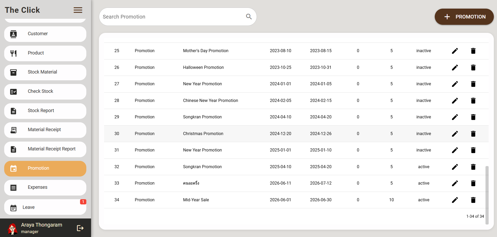
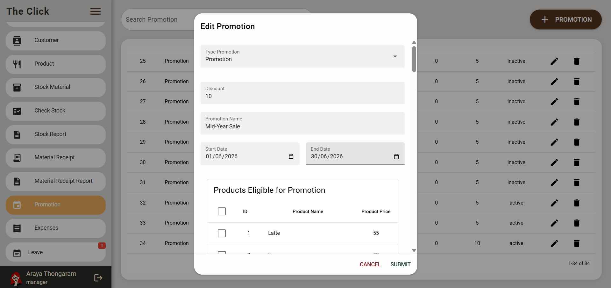
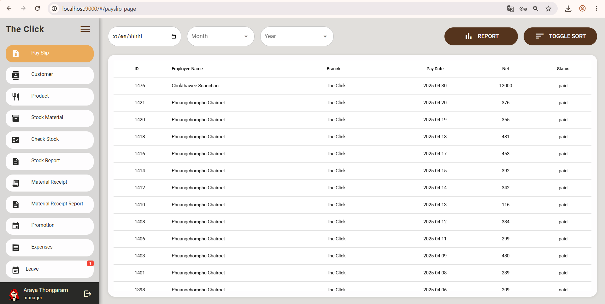
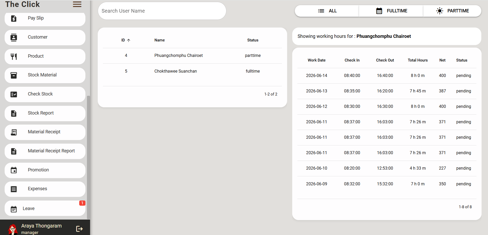
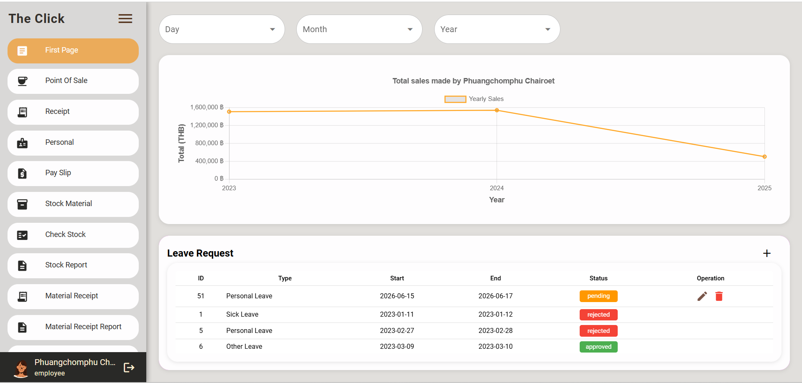
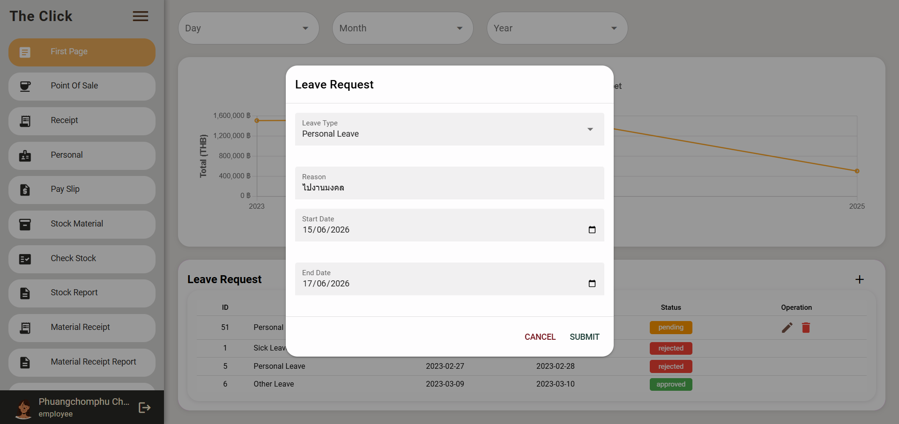
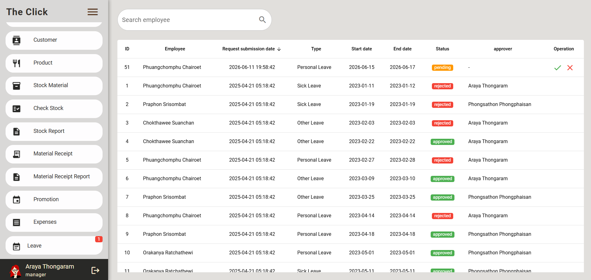
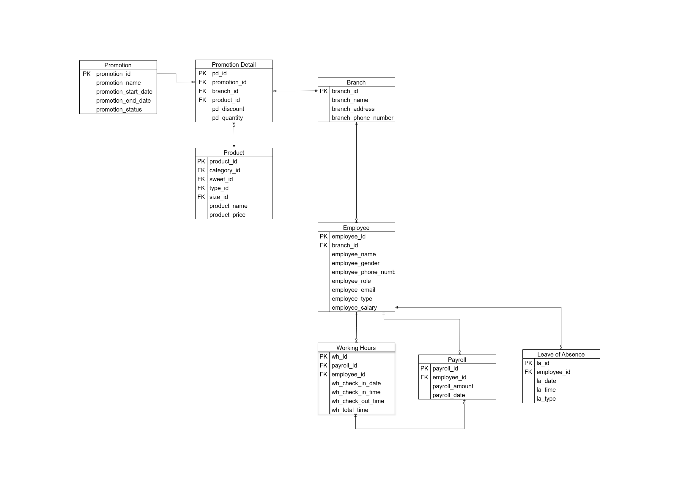

# D-Coffee Management System

## Project Overview

D-Coffee Management System is a full-stack web application developed for managing coffee shop operations. The system supports product management, promotion management, employee management, payroll processing, and leave request management.

This project was developed as a team project during university coursework. My primary responsibilities focused on the Promotion Module, Payroll Module, Leave of Absence Module, and related database design and implementation.

---

## My Responsibilities

### Promotion Module

* Developed frontend and backend features for promotion management
* Designed relationships between Promotion, Product, and Promotion Detail entities
* Implemented dynamic product filtering based on selected promotions
* Developed CRUD operations for promotions
* Managed promotion scheduling and status updates

### Payroll Module

* Developed payroll management functionality
* Implemented employee working hour tracking
* Developed salary calculation features
* Managed payroll confirmation workflows
* Designed and maintained payroll-related database structures

### Leave of Absence Module

* Developed leave request workflows
* Implemented approval and rejection processes
* Developed leave request CRUD operations
* Integrated leave management APIs with frontend interfaces

### Database Design

* Designed and modified relational database structures
* Created and maintained relationships between multiple entities
* Implemented foreign key constraints and database normalization concepts
* Worked with MySQL and SQLite databases

---

## Tech Stack

### Frontend

* Vue 3
* Quasar Framework
* TypeScript

### Backend

* NestJS
* TypeORM

### Database

* SQLite
* MySQL

### Collaboration Tools

* GitLab
* Postman

---

## Key Features

### Promotion Management

* Create, update, and delete promotions
* Assign products to promotions
* Automatic promotion status management
* Branch-based promotion assignment

### Payroll Management

* Employee working hour tracking
* Payroll generation
* Monthly payroll summary
* Salary payment confirmation

### Leave Request Management

* Leave request submission
* Approval and rejection workflows
* Employee leave tracking

---

## Database Experience Demonstrated

* Entity Relationship Design
* One-to-Many Relationships
* Many-to-Many Relationships
* Foreign Key Management
* CRUD Operations
* Database Refactoring
* SQL Query Development

---

## Screenshots

### Promotion Management

---

### Payroll Management

---

### Leave Request Management

---

## Database Design

As part of my responsibilities, I participated in database design, relationship analysis, schema improvement, and backend integration.

### ER Diagram (Modules Developed by Me)

### Database Concepts Applied

* Relational Database Design
* One-to-Many Relationships
* Foreign Key Management
* Payroll & Working Hours Integration
* Promotion-Product Mapping
* CRUD Operations
* Backend API Integration
* Database Refactoring

---

## Team Project Information

This project was developed as a team project. My contributions focused on the Promotion Module, Payroll Module, Leave of Absence Module, and related database implementation.
